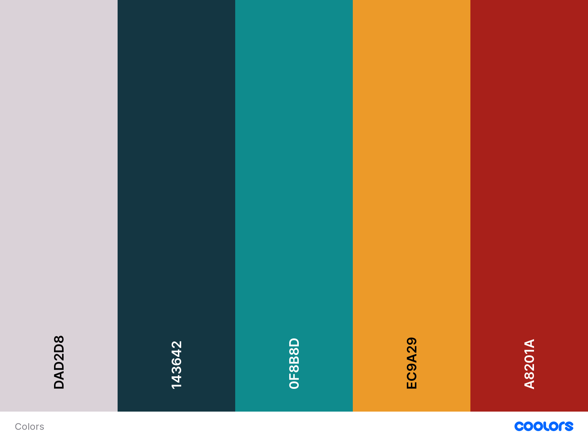

# Hamburgueria Floripa Frontend
## :information_source: O que é?
Esse projeto pessoal foi desenvolvido com o intuito de praticar e aperfeiçoar meus conhecimentos em Frontend. O desafio consistia em utilizar uma paleta de cores gerada aleatoriamente no site [Coolors](https://coolors.co/) e escolher um tema para o site (Hambúrguer). Feito isso, montei o Frontend do site simulando o website para uma Hamburgueria.

### Resutado final:

### Etapas mencionadas do processo:

## :warning: Tecnologias Utilizadas
Diversas tecnologias que auxíliaram na finalização do projeto. As principais são:

[HTML](https://devdocs.io/html/)

[CSS](https://devdocs.io/css/)

[React](https://pt-br.reactjs.org/)

[JavaScript](https://developer.mozilla.org/pt-BR/docs/Web/JavaScript)

[Material UI](https://material-ui.com/pt/)

Entre outra bibliotecas que auxiliaram na construção.

